# PatchPilot architecture

```mermaid
flowchart LR
    Task[Task or issue] --> Planner[Plan + approval gate]
    Planner --> Inspector[Repository inspector]
    Inspector --> Tools[Allow-listed tools]
    Tools --> Edit[Approved file edit + diff]
    Edit --> Tests[Test runner with timeout]
    Tests --> Recovery[At most one recovery callback]
    Recovery --> Review[Diff + human review]
    Review -->|approved later| Commit[Explicit user action]
```

The current execution layer stops before autonomous commits or pushes. Every
edit requires approval, tests are time-bounded, and recovery is limited to one
callback. A future model planner must operate inside these boundaries.
