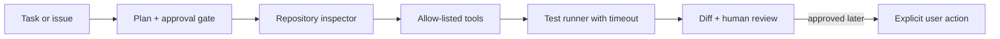

# PatchPilot architecture

```mermaid
flowchart LR
    Task[Task or issue] --> Planner[Plan + approval gate]
    Planner --> Inspector[Repository inspector]
    Inspector --> Tools[Allow-listed tools]
    Tools --> Tests[Test runner with timeout]
    Tests --> Review[Diff + human review]
    Review -->|approved later| Commit[Explicit user action]
```

Day 1 deliberately stops before autonomous editing, commits, or pushes. The
approval gate and tool policy are the foundation for later LLM integration.
